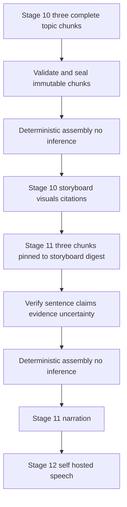

# RepoVox Director architecture

Proposed design, 2026-10-08; no weights trained, downloaded or evaluated locally. [Selection](model-selection.md) · [Training](training-strategy.md) · [Evaluation](evaluation-plan.md) · [Director schema](director.schema.json) · [Pipeline](../architecture/pipeline.md)

## Purpose, authority and contracts

Director turns a validated Project Knowledge Model (PKM) and locked evidence-verification ledger into accurate explanations, storyboard sections, narration, architecture/flow graphs, safe scene instructions and citation mappings. It is a specialized product component, initially evaluated with an unchanged open-weight base. “RepoVox Director fine-tuned release” may only identify a promoted RepoVox adapter/checkpoint with dataset/evaluation provenance. Never claim the upstream base was trained from scratch by RepoVox.

Self-hosted inference is the primary production strategy. Normal videos require **no paid third-party LLM/TTS API**. External AI experiments are disabled by default and require explicit owner approval, named permitted data, documented terms and a separate budget; no outage/quality fallback to paid AI.

The private gateway selects a stage-specific schema from the trusted DB stage, never from a client/model declaration. Schema v2.1 [Director contracts](director.schema.json) use `stage10_input` / `stage11_input`, `stage10_chunk` / `stage11_chunk` and assembled `stage10_output` / `stage11_output`. The former combined storyboard+narration model response is removed. Repository input, model responses and candidate claims remain untrusted until separate validation; Director cannot modify the source-verification ledger.

## Stage contracts and deterministic assembly

| Stage | Inference response (complete chunk JSON) | Final stage output and ownership |
| --- | --- | --- |
| 10 `storyboard` | `#/$defs/stage10_chunk`: stage=storyboard, chunk_id, input_digest, storyboard.scenes, visual_instructions, citation_mappings. No narration field. | Trusted assembler creates `#/$defs/stage10_output`, then persists storyboard artifact payload: scenes, finalized visual_instructions, finalized scene citation_mappings and assembly manifest. **Stage 10 owns all visual instructions and scene citation mappings.** |
| 11 `narration` | `#/$defs/stage11_chunk`: stage=narration, chunk_id, input_digest, storyboard_digest and narration.sentences. No scenes/visuals/citation-map replacement. | Trusted assembler creates `#/$defs/stage11_output`, then persists narration artifact payload: ordered sentences with claim/evidence/uncertainty, storyboard_digest and assembly manifest. Stage 11 cannot alter Stage 10. |

Plan `topic-pairs-v1` is frozen before the first Stage 10 call: three chunk IDs in order `purpose_stack`, `architecture_flow`, `code_summary`, each containing its named two topics. Stage 10 produces 1-4 complete scenes/topic (2-8/chunk, 6-24 total). Stage 11 uses the same chunks and the exact approved scene/citation subset. Six ordinary calls total, three per stage; each returns a **complete partial-topic output**, never a complete whole-stage output or a truncated JSON fragment. A chunk must cover both assigned topics and every assigned scene for narration. If context cannot support that complete chunk, fail coverage; do not silently split into extra calls.

Scene IDs are `{topic}-{ordinal}`, contiguous from 1 per topic. The offline example has purpose-1 through summary-1. Duplicate scene/chunk IDs, missing topic/scene/claim references, wrong-stage fields and unapproved topics fail rather than being renamed/deduplicated. Within a completed chunk, model content is immutable. The assembler uses fixed topic order and numerical scene ordinal; visual/citation records are joined one-to-one by scene ID, never array position. Narration is grouped by that fixed scene order, preserving the model's sentence order within each scene. Delivery order of completed chunks does not change assembly.

Each response is schema-validated, then source/owner/SHA/ID/semantic-validated before sealing a `stage_chunks` row under the active stage fence. Citation bindings carry exact locked claim status plus evidence IDs; node/edge refs resolve through those bindings. Renderer derives inferred/documentation-only badges from the locked status, not model confidence. Technical sentences have nonempty claim/evidence IDs and preserve status; mixed-status facts use separate sentences, nontechnical transitions have empty mappings and uncertainty=none. New or unsupported assertions fail post-narration entailment checks; reference equality alone does not prove paraphrase accuracy.

Canonical body digest `canon-json-v1` = SHA-256 of UTF-8 JSON with sorted object keys, compact separators, preserved string/array contents, no NaN/Infinity. Input digest excludes its own input_digest field and includes stage/chunk, owner/snapshot/SHA, selected context and (Stage 11) exact storyboard digest. The input body digest alone does not identify a release: durable operation/cache keys additionally bind the server-pinned model release and configuration digest. Model cannot stamp trusted release/usage metadata; DB operation/cache identity supplies it. Final assembly manifest records plan version and exactly three ordered chunk IDs/body digests. Stage 11 storyboard_digest hashes the **persisted Stage 10 payload**, including its assembly manifest, not a free model summary.

After all three chunks are sealed, assemble in memory without another inference call, run final schema/global uniqueness/coverage/citation/uncertainty/entailment checks, upload immutable final payload and commit the single authoritative stage output pointer under fence. Only then may the next stage become ready. Completed chunks are durable intermediate work, not published stage outputs or dashboard percentage successes; partial/invalid/truncated JSON is never a completed chunk. [Persistence](../architecture/data-model.md#director-chunk-persistence-and-resume) defines recovery.

The [synthetic examples](../architecture/examples/pipeline.json) contain valid six input/chunk pairs, two assembled outputs, persisted artifacts and illustrative usage receipts. [Offline checks](../../tools/director_contract_checks.py) demonstrate contract assembly only, not an implemented worker/model system.

## Serving and inference configuration

Private model gateway authenticates backend stage-scoped service grants (issuer, audience, owner, job, stage, fence, model release, expiry ≤60s), validates DB lease/budget and enforces fixed schemas/limits. Gateway calls vLLM on private loopback/task network. Engine has no public port, direct browser access, repository tools or arbitrary runtime adapter selection. AWS SG allows orchestration role→gateway only; TLS/mTLS between services; deny internet egress during inference. Tokenizer/template/model IDs come from signed release manifest, never client data. Request/prompt logging and inference telemetry payloads disabled.

Evaluate engines:

| Engine | Benefit | Cost/risk and decision |
| --- | --- | --- |
| vLLM (provisional) | GPU serving, constrained JSON decoding, supported quantized formats and LoRA serving | Larger CUDA/runtime compatibility surface; exact GPU/quantizer/adapter/schema support must pass tests. Use owner-pinned image/version, JSON grammar plus separate full validator. [Official structured output](https://docs.vllm.ai/en/stable/features/structured_outputs/) and [quantization](https://docs.vllm.ai/en/stable/features/quantization/) docs accessed 2026-10-08. |
| SGLang | Comparable structured outputs and scheduling | Additional engine/operator compatibility work; switch if measured memory/latency/JSON reliability better. [Official schema support](https://github.com/sgl-project/sglang/blob/main/docs/docs/advanced_features/structured_outputs.mdx). |
| llama.cpp | Small footprint, GGUF/CPU or smaller GPU option | Lower expected large-model serving capacity is an estimate; separate quantization/adapter path. Candidate for low-volume evaluation, not assumed latency-compliant. [Official repository](https://github.com/ggml-org/llama.cpp). |

Initial gateway limits: <=1 MiB serialized request, <=256 KiB response and JSON depth <=32 before schema/token validation; reject oversized bodies before allocation. Token limits: 16,384 total tokens/request, ≤12,288 prompt including fixed instructions/schema, ≤4,096 generated; aggregate <=120k input/12k output and <=1,200 GPU compute-seconds/job including repair/replay. Target base workload 60k/6k across six bounded calls. No YaRN/full advertised context at launch. Temperature 0, top-p 1, pinned seed where supported, no tools/thinking stream. Version prompt/chat template/grammar/tokenizer; deterministic settings do not guarantee byte-identical GPU output. Baseline one active sequence per GPU, ≤8 pending requests/gateway, ≤1 active Director request/owner; memory utilization target ≤85% of observed available VRAM. Initial GPU count one; scale only under approved capacity plan.

Context builder ranks entrypoints, relevant dependencies and graph claims deterministically; budget source evidence first, trim unrelated modules and duplicate descriptions, then select context for the fixed two-topic chunks. Never truncate a citation range or discard an uncertainty label to fit. Record omitted claim/module IDs and token counts. If a section loses adequate evidence, fail `insufficient_evidence`; do not summarize omitted source as observed fact. Context cache keyed by owner and release; disable cross-request prefix/KV caching at baseline. Clear transient request buffers; no customer prompts into training.

## Validation, resources and failure handling

Stage 10/11 each have <=360s per attempt, <=3 physical calls per attempt, maximum two attempts, and <=4 physical calls **per stage across all attempts** (three ordinary plus one failure/repair allowance). One quality repair per stage across attempts; a transient replay uses the same fourth-call allowance. A repair that cannot fit the first attempt's call/time limit requires the one permitted stage retry. Every request, including invalid/failed/aborted/unknown/replayed requests, consumes call reservations, actual token/GPU usage and remaining job budget; chunk reuse and deterministic assembly consume no inference calls. Deadline <=180s/call and remaining stage/job deadline; reject before sending if any remaining cap cannot cover work. Aggregate <=120k prompt/12k output and <=1,200 GPU-seconds across Stages 10+11 and retries. Each request independently stays <=12,288 prompt + <=4,096 output within 16,384 context; unused context from another call cannot be borrowed. Worst-case retry may exhaust a cap and fail rather than promise completion.

On restart, query sealed chunk keys/digests under the same frozen plan/release/input. Revalidate immutable completed bodies and only request missing chunks; recompute assembly after a crash without calling the model. At launch partial-chunk reuse is within the same job only; full committed artifact reuse retains existing owner/version/cache rules. Unknown old execution must be stopped/aborted or drained/fenced before replay; a new stage fence does not alone stop GPU work. Persist partial-failure usage conservatively until reconciliation. No parallel duplicate engine request, unbounded repair, model upgrade, paid fallback or backwards stage transition. [Job recovery](../architecture/data-model.md#idempotency-delivery-and-recovery) retains the 45-minute deadline and PostgreSQL durable truth.

Warm baseline: one L4-class GPU, 24 GB advertised memory; runtime allocatable memory is lower, validate it. Quantized weights estimated 8–10 GiB, one 16k BF16 KV sequence ~3 GiB plus workspace: budget 14–18 GiB, **unmeasured**. Reject excess context before allocation; circuit-break on OOM, do not accept unbounded engine backlog. [Deployment](../operations/deployment.md) owns CPU RAM/disk/network/startup/health controls.

## Identity, integrity and ownership

Every generated artifact has schema-v2 `generation_metadata`: release ID, base-model ID/revision/license/source, base and served-weight SHA-256, adapter ID/digest or null, training dataset version or null, tokenizer digest, prompt/template/engine/quantization versions, token counts, duration, GPU type/seconds, validation status and measured-versus-illustrative marker. Server stamps metadata after validation; model cannot self-attest its provenance.

Release manifest pins upstream commit, complete file hashes, runtime/container digest, licenses/notices, locally produced quantization, adapter compatibility and evaluation report. Download model assets only in approved build/research lane, verify allowlisted files and hashes, reject pickle/remote Python code (`trust_remote_code=false`); if unsafe upstream TTS format needs conversion, inspect/convert in isolated build lane to safe serving format. Registry objects private/read-only to serving, writer separate and owner-controlled. Upstream licenses stay attached; independently produced dataset/adapter rights documented separately, no invented exclusive ownership of the base. Promotion/rollback are [training Stage E](training-strategy.md#stage-e-release).
