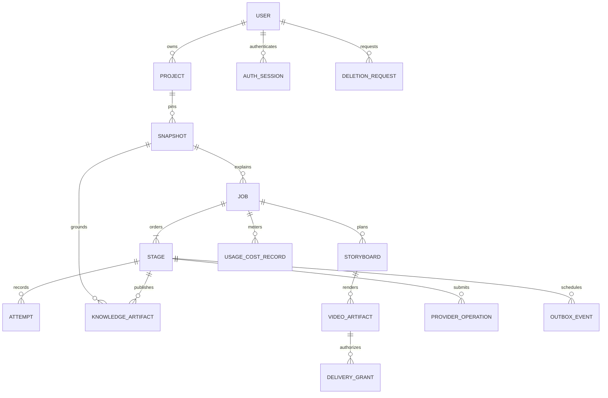
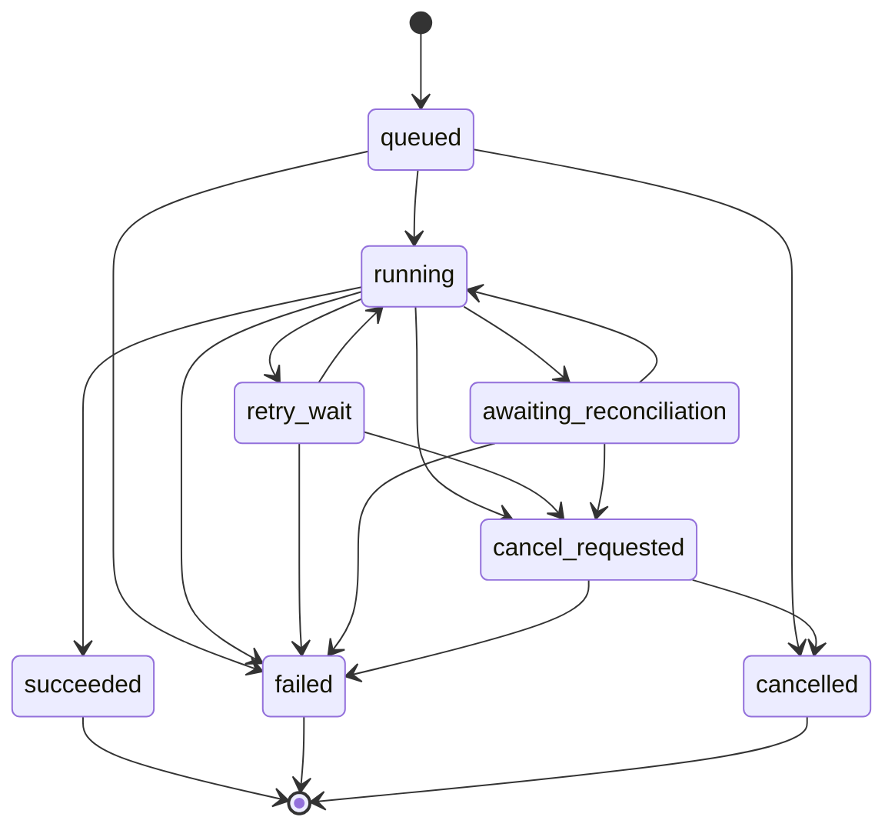

# Persistence and job orchestration

Proposed, 2026-10-08. [Pipeline](pipeline.md) · [Reliability](../operations/reliability.md) · [Ownership tests](../security/threat-model.md#security-acceptance-suite) · [Retention](../operations/deployment.md#retention-and-deletion)

## Entities and ownership

Use UUID primary keys, UTC timestamps, explicit schema/version fields and indexed owner/job/state queries. Every tenant row has `owner_id`; composite FKs `(owner_id, parent_id)` reference a parent's unique `(owner_id, id)`. This prevents a foreign key from attaching another owner's data. No team/shared ownership in V1. Soft deletion is an authorization tombstone, not permission to retain indefinitely.

| Entity | Key fields / relationships | Authorization and lifecycle |
| --- | --- | --- |
| `users` | `id`, unique `(issuer, auth_subject)`, minimal email/display, status/deleted_at | Token subject resolved server-side; user can read/update own profile and request deletion. No arbitrary subject mapping. Cognito deletion reconciled with app deletion. |
| `auth_sessions` | owner FK, opaque session nonce hash, encrypted refresh credential, idle/max expiry, revoked_at | BFF-only read/write under validated owner; user can revoke own sessions. No browser access to refresh credential; encryption key separate in Secrets Manager. PostgreSQL durable record, Redis optional cache only. Logout/deletion revokes associated delivery grants; expiry cleaner removes credentials/rows within 24h. |
| `projects` | owner FK, canonical repo locator, title, status | User CRUD own projects; locator not authorization. Same public repo in two accounts has separate rows/artifacts. |
| `repository_snapshots` | owner/project FK, full SHA, repo ID/default branch, acquisition/visibility time, manifest/body digest, pipeline/parser versions | Owner may read redacted metadata via project; workers only for leased job. Immutable snapshot instance; unique `(owner_id, project_id, SHA, acquisition_version)`; visibility checked before new acquisition. |
| `generation_jobs` | owner/project/snapshot FKs, state/version, config digest, idempotency key/request digest, deadline, prior_job_id, reserved budget, cancel time | Own submit/read/cancel/retry. Unique `(owner_id, idempotency_key)`; repeated key with changed request gets 409. Prior-job composite FK prevents cross-owner reuse. Terminal rows immutable except deletion/expiry metadata. |
| `job_stages` | owner/job FK, ordinal 1–14/stage key, status, cache key, artifact pointer, next_attempt_at, lease token/expiry, stage deadline | Unique `(job_id, ordinal)`; API read only, worker/dispatcher transitions with scoped role. One authoritative output pointer/stage. |
| `job_attempts` | owner/stage FK, attempt number, fencing epoch, worker/task ID, start/end, heartbeat, code, outcome, metrics | Unique `(stage_id, attempt_no)`; append history; worker updates only current leased attempt. User sees sanitized errors, not diagnostic payload. |
| `knowledge_artifacts` | owner/snapshot/job/stage FKs, kind/version, upstream IDs/input digest, checksum, JSONB summary/private object key, published_at/expires_at | Owner read redacted artifacts through job API. Immutable payload after publication; fenced worker writes. Includes manifest/structure/PKM/evidence/verification/narration/audio/render manifests. |
| `storyboards` | owner/job/snapshot FK, knowledge_artifact FK, version, digest/object pointer, approved claim set | Owner read only, trusted worker creates. Immutable; no V1 editing. |
| `video_artifacts` | owner/job FK, unique successful publication/job, storyboard FK, MP4/sidecar/caption keys, SHA/hash/size/probe, expires_at/deleted_at | Owner-only playback/download grants; workers upload, API publishes after checks. No stored signed URLs. Expiry revokes delivery. |
| `delivery_grants` | owner/video FK, nonce hash, expiry/revoked_at, mode, cumulative reserved/served bytes | Owner mints through API; signed media route validates grant and tombstone every request. Atomic byte reservations against video/owner aggregate stop concurrent replay exceeding quota. No source/secrets. Grant expires ≤5 min; revoked on deletion/logout; short records removed after 24h, aggregated usage remains. |
| `usage_cost_records` | owner/job/attempt FK, operation_id, provider/model/price_version, units, estimated/actual amount USD, reservation/settlement status | Append ledger with reversal/adjustment entries, not mutable overwritten charges. User reads own aggregate; operator reconciliation uses audited access. Includes failed/unknown charges and compute/storage/delivery estimates. |
| `provider_operations` | owner/stage FK, unique operation key, request digest, provider idempotency key/request ID, status/result pointer, usage record | Workers operate only under current lease. Sensitive payload not in logs. Durable send intent distinguishes planned/submitted/succeeded/failed/unknown; unknown never auto-resubmitted. |
| `outbox_events` | owner/job/stage FK, unique event ID/type, due_at, published_at | Internal dispatcher only; identifiers not source text. Publication may repeat. Rows tied to tenant for deletion; audit minimum metadata retained under policy. |
| `deletion_requests` | owner/project or account scope, state/tombstone, requested/completed_at, retry error | Owner requests/reads own; cleaner executes idempotently. Blocks new stages/URLs/reservations; all object versions and identity cleanup tracked. |

Runtime API role uses mandatory owner filters **and** PostgreSQL RLS: transaction-local owner context set only from validated identity, policies on tenant tables, fail closed without context, no BYPASSRLS/table-owner role. Worker roles do not bypass all tenant rows: stage claim resolves owner from DB and sets transaction owner context; restricted procedures validate stage/lease and constrain write relations. Infrastructure migration/admin roles separate and never used by HTTP handlers. Objects use `environment/owner/snapshot/job/kind/digest` keys; these keys alone are not authorization. IAM and scoped application read/URL checks are both required.

## Generation state machine

All transitions are transactionally guarded by expected state/version, DB time, owner authorization or internal role, deadline/budget and cancellation checks. Unlisted transitions forbidden. State diagram is illustrative; table is authoritative.

| From | Allowed destination | Guard/action |
| --- | --- | --- |
| admission (no row) | `queued` | Valid URL/public SHA; consent/quota; idempotency request; create snapshot/job + succeeded validate stage + ready acquire stage + reservation + outbox in one transaction. Remote validation failure leaves no row. |
| `queued` | `running` | First worker obtains acquire-stage lease; budget/deadline/owner active. |
| `queued` | `cancelled`, `failed` | Owner cancel/deletion; or absolute deadline/admission corruption, with sanitized code. No work yet. |
| `running` | `retry_wait` | Active stage transient failure, retry remains, no other stage running; persist due time. |
| `retry_wait` | `running` | Due stage successfully reclaimed with new fence. |
| `running` | `awaiting_reconciliation` | Provider outcome ambiguous; block paid retry and downstream stage. |
| `awaiting_reconciliation` | `running` | Audited reconciliation recovers valid paid result or confirms no charge/submission and safe bounded retry; same job deadline/budget still apply. |
| `running` | `succeeded` | All stages succeeded, probe valid, artifact/object exists, reservation settled, no cancellation/deletion. Atomic final publication. |
| `running`, `retry_wait`, `awaiting_reconciliation` | `cancel_requested` | Owner cancel or deletion; increment cancellation epoch; stop new leases/paid operations/publication. |
| `cancel_requested` | `cancelled` | Active task exited/terminated, fence revoked and scratch cleanup scheduled; remaining stages cancelled, settle known usage, hold unknown charges. |
| `running`, `retry_wait`, `awaiting_reconciliation` | `failed` | Permanent/evidence/budget failure, attempts exhausted or absolute deadline. Fence revoked; cleanup/outbox and settlement. |
| `cancel_requested` | `failed` | Termination/control failure exceeds cancellation timeout; mark code `cancellation_cleanup_failed`, retain revocation/tombstone and alert. Cleanup still retried. |
| terminal: `succeeded`, `failed`, `cancelled` | none | Retry is a **new** job with `prior_job_id`; original result/history does not change. Deletion affects availability, not terminal outcome. |

## Stage attempts and timeouts

Stage states: `pending -> ready -> running -> succeeded`; `running -> retry_wait -> ready`; `running -> blocked -> ready` only after safe provider reconciliation; `running -> failed` on permanent/exhausted work. Any nonterminal stage -> `cancelled` on job cancellation, or `failed` on job deadline/terminal failure. `ready -> failed` also allowed for policy/deadline before lease. `succeeded/failed/cancelled` immutable. Only one ready/running/retry_wait/blocked stage per job; next pending becomes ready in same transaction as prior success. Stage 1 starts succeeded because validation occurs at admission.

| Stage | Hard wall timeout/attempt | Maximum attempts incl first |
| --- | --- | --- |
| validate | 10 seconds at admission | 1 (client may resubmit same key after dependency failure) |
| acquire | 120 seconds | 3 |
| filter / structure / entrypoints | 30 / 120 / 30 seconds | 2 each |
| infer / knowledge / evidence / verify | 90 / 30 / 30 / 90 seconds | 2 each; paid retry only when known safe |
| storyboard / narration | 60 / 60 seconds | 2 each; bounded repair part of budget |
| tts | 120 seconds | 2; ambiguous outcomes blocked |
| render / encode | 600 / 180 seconds | 2 each |

Absolute job deadline is 45 minutes from admission including queue/retry/reconciliation. Stage timeouts include local substeps; external request timeout ≤stage remaining time. Heartbeat every 15s, lease expires 60s after last renewal using DB clock; lease cannot exceed stage/job deadline. Retry backoff `min(120s, 5s * 2^(attempt_no-1))` plus jitter 0–5s, persisted `next_attempt_at`. No retry for invalid/malicious input, insufficient evidence, secret policy rejection, auth, deterministic schema error or budget exhaustion. 429/5xx/provider network retry only if outcome known safe; honor Retry-After within remaining deadline. Logical quality repair capped once per affected stage, consumes paid budget, not an extra free retry.

Cancellation checks at least every 5s in local loops and immediately before each paid call/upload publication. In-flight HTTP may bill even after cancellation. Terminate task if no exit within 60s of request, revoke fence first; record unknown paid costs conservatively. Cancellation/success race is serialized by job row lock: if success committed first, cancel returns terminal conflict; if cancel committed first, success cannot publish.

## Idempotency, delivery and recovery

1. Submission idempotency unique by owner/key for 90-day history period; same request returns same job even after retries. Canonical request digest includes repo/config/pipeline versions; key reuse with changed request returns 409. Retried **new** job uses a new key and resolves current HEAD; artifact reuse only if SHA/config/versions/digests match.
2. Outbox committed with each ready stage; dispatcher publishes stage/event IDs to Redis then records publication. Crash between those operations repeats delivery. Celery late acknowledgement/visibility timeout is configured above task timeout, but PostgreSQL lease/CAS is the duplicate defense. Outbox dispatch at least every 5s; reconciler scans all due nonterminal stages every 30s, including published-but-never-consumed notifications. Redis data loss is reconstructable.
3. Atomic stage claim locks eligible row (`FOR UPDATE SKIP LOCKED`), verifies job active/budget/deadline, assigns monotonically increasing fence and lease. Duplicate messages no-op if another unexpired lease/output exists. Every heartbeat, provider send claim and artifact publication checks fence+state+expiry. Expiry alone cannot allow stale writes; epoch invalidates them. Task-start reservations in DB prevent dispatcher replicas exceeding concurrency; ECS task IDs reconciled after uncertain task-start responses.
4. Artifact cache key = owner + snapshot SHA + stage + upstream checksums + parser/selector/prompt/model/voice/template/pipeline versions + configuration digest. Successful immutable artifact is reused only after checksum, schema, ownership, expiry and verification checks. Retained outputs let restart resume next stage without paid work repetition. No cross-tenant cache; purge invalid/expired results.
5. External operation: record unique send intent/request digest, reserve maximum cost, and commit operation status before send. Use provider idempotency key **only if verified supported**. Capture result/request ID/usage into private deterministic staging object, then commit result pointer/usage/stage with fence. Persisted result can be validated/recovered after worker death. Crash after send but before durable response is `unknown`, not an automatic second charge; reconcile provider status/billing if possible, otherwise job fails at deadline with charged reservation held for audit. Operator may authorize a new bounded operation only after documenting duplicate-billing risk/remaining budget, never under original unknown key.
6. Object upload and DB commit are not a distributed transaction: upload immutable attempt-scoped key, verify checksum, then publish pointer under lease transaction. Crash-before-commit leaves an orphan that cleaner removes after 24h; crash-after-commit returns existing output. Stale attempts cannot overwrite current keys. Final success additionally verifies S3 object exists and probe record before atomic metadata publication.
7. DB outage: do not start paid work or new stages; worker can finish local bounded compute but cannot publish without valid renewed lease. Reconciler expires abandoned work after DB returns. Redis outage: retain due state/outbox, suspend dispatch and rebuild without losing jobs. Lost source scratch reacquired at exact SHA under policy; reuse paid artifacts only if input checksum matches.

Unique constraints cover usage operation settlement and stage output pointers; budget reservations never double-release. Unknown costs remain reserved until reconciled, even if job terminal. Cleanup follows [retention/deletion](../operations/deployment.md#retention-and-deletion); terminal cancellation/failure never disables cleanup retries. [Recovery acceptance tests](../operations/reliability.md#recovery-acceptance-tests) are required before launch, not executed Phase 0 tests.
