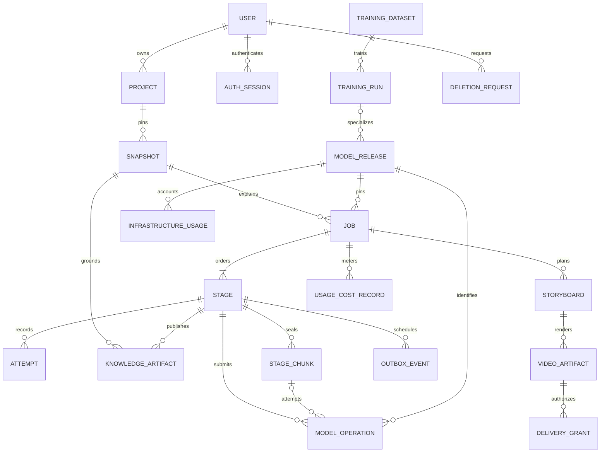
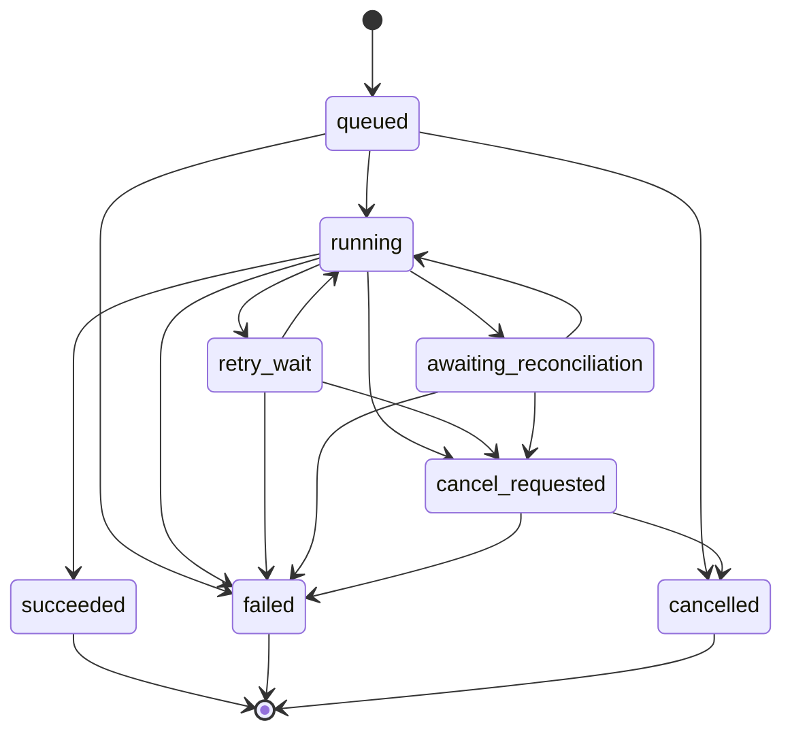

# Persistence and job orchestration

Proposed, 2026-10-08. [Pipeline](pipeline.md) · [Reliability](../operations/reliability.md) · [Ownership tests](../security/threat-model.md#security-acceptance-suite) · [Retention](../operations/deployment.md#retention-and-deletion)

## Entities and ownership

Use UUID primary keys, UTC timestamps, explicit schema/version fields and indexed owner/job/state queries. Every tenant row has `owner_id`; composite FKs `(owner_id, parent_id)` reference a parent's unique `(owner_id, id)`. This prevents a foreign key from attaching another owner's data. No team/shared ownership in V1. Soft deletion is an authorization tombstone, not permission to retain indefinitely.

| Entity | Key fields / relationships | Authorization and lifecycle |
| --- | --- | --- |
| `users` | `id`, unique `(issuer, auth_subject)`, minimal email/display, status/deleted_at | Token subject resolved server-side; user can read/update own profile and request deletion. No arbitrary subject mapping. Cognito deletion reconciled with app deletion. |
| `auth_sessions` | owner FK, opaque session nonce hash, encrypted refresh credential, idle/max expiry, revoked_at | BFF-only read/write under validated owner; user can revoke own sessions. No browser access to refresh credential; encryption key separate in Secrets Manager. PostgreSQL durable record, Redis optional cache only. Logout/deletion revokes associated delivery grants; expiry cleaner removes credentials/rows within 24h. |
| `projects` | owner FK, canonical repo locator, title, status | User CRUD own projects; locator not authorization. Same public repo in two accounts has separate rows/artifacts. |
| `repository_snapshots` | owner/project FK, full SHA, repo ID/default branch, acquisition/visibility time, manifest/body digest, pipeline/parser versions | Owner may read redacted metadata via project; workers only for leased job. Immutable snapshot instance; unique `(owner_id, project_id, SHA, acquisition_version)`; visibility checked before new acquisition. |
| `generation_jobs` | owner/project/snapshot FKs, state/version, config digest, idempotency key/request digest, deadline, prior_job_id, reserved budget, cancel time | Own submit/read/cancel/retry. Unique `(owner_id, idempotency_key)`; repeated key with changed request gets 409. Prior-job composite FK prevents cross-owner reuse. Terminal rows immutable except deletion/expiry metadata. |
| `job_stages` | owner/job FK, ordinal 1–14/stage key, status, cache key, artifact pointer, next_attempt_at, lease token/expiry, stage deadline | Unique `(job_id, ordinal)`; API read only, worker/dispatcher transitions with scoped role. One authoritative output pointer/stage. |
| `job_attempts` | owner/stage FK, attempt number, fencing epoch, worker/task ID, start/end, heartbeat, code, outcome, metrics | Unique `(stage_id, attempt_no)`; append history; worker updates only current leased attempt. User sees sanitized errors, not diagnostic payload. |
| `knowledge_artifacts` | owner/snapshot/job/stage FKs, kind/version, upstream IDs/input digest, checksum, JSONB summary/private object key, published_at/expires_at | Owner read redacted artifacts through job API. Immutable payload after publication; fenced worker writes. Includes manifest/structure/PKM/evidence/verification/narration/audio/render manifests. |
| `storyboards` | owner/job/snapshot FK, knowledge_artifact FK, version, digest/object pointer, approved claim set | Owner read only, trusted worker creates. Immutable; no V1 editing. |
| `video_artifacts` | owner/job FK, unique successful publication/job, storyboard FK, MP4/sidecar/caption keys, SHA/hash/size/probe, expires_at/deleted_at | Owner-only playback/download grants; workers upload, API publishes after checks. No stored signed URLs. Expiry revokes delivery. |
| `delivery_grants` | owner/video FK, nonce hash, expiry/revoked_at, mode, cumulative reserved/served bytes | Owner mints through API; signed media route validates grant and tombstone every request. Atomic byte reservations against video/owner aggregate stop concurrent replay exceeding quota. No source/secrets. Grant expires ≤5 min; revoked on deletion/logout; short records removed after 24h, aggregated usage remains. |
| `usage_cost_records` | owner/job/attempt FK, operation_id, model release/engine/price_version, input/output tokens, duration, GPU type/seconds, CPU seconds, units, estimated/actual amount USD, reservation/settlement status | Append ledger with reversal/adjustment entries, not mutable overwritten charges. User reads own aggregate; operator reconciliation uses audited access. Includes failed/unknown charges and compute/storage/delivery estimates. |
| `model_operations` | owner/stage FK, unique operation key, required logical chunk_id/plan_digest for Director stages, nullable completed_chunk FK sealed after validation, request digest, gateway request ID, release/weight/adapter/dataset/tokenizer/quantization/prompt digests, status/result pointer, usage record | Workers operate only under current lease. Sensitive payload not in logs. Durable local intent distinguishes planned/submitted/succeeded/failed/unknown; active unknown execution never auto-resubmitted. Release FK is internal approved registry only. |
| `stage_chunks` | owner/stage FK, chunk_id, plan/config/input digest, model release, immutable body/private key/checksum, winning operation FK, validation/created time | Stages 10/11 only; insert completed schema+semantic-validated chunks under stage fence, unique `(stage_id, plan_digest, chunk_id)`. Owner read sanitized progress only; worker scoped by lease. No update of completed body; retries reuse same-job chunks, never arbitrary tenant/model caches. Final publication still one stage pointer. |
| `model_releases` (internal) | immutable release/base revision/license/source, file/adapter/tokenizer hashes, dataset version, prompt/engine/quantizer versions, evaluation report and revoked_at | Owner-controlled operator registry, no tenant write/direct list. API exposes selected sanitized release metadata only through own jobs. Runtime read-only approved releases, no arbitrary adapter loading. |
| `training_datasets` / `training_runs` (research) | rights manifest/version/deletion ledger, run config/seeds/checkpoint hashes, upstream release, evaluation status | Separate research DB/bucket/roles controlled by Stevemeg; never attach customer jobs automatically. No ordinary tenant API access. Upstream dataset attribution/rights recorded separately from Git contributors. |
| `infrastructure_usage` (internal) | environment/host/release/hour, warm/busy/load/idle GPU hours and fixed charges | Operator-only append ledger; no prompts/tenant source. Aggregate allocations distinct from per-job usage. Research/project scope separate. |
| `outbox_events` | owner/job/stage FK, unique event ID/type, due_at, published_at | Internal dispatcher only; identifiers not source text. Publication may repeat. Rows tied to tenant for deletion; audit minimum metadata retained under policy. |
| `deletion_requests` | owner/project or account scope, state/tombstone, requested/completed_at, retry error | Owner requests/reads own; cleaner executes idempotently. Blocks new stages/URLs/reservations; all object versions and identity cleanup tracked. |

The ER diagram shows key relationships; composite owner FKs described above apply even where not drawn. Model release/host ledger and research entities are operator-only, with no customer-source access or tenant writes. Runtime API role uses mandatory owner filters **and** PostgreSQL RLS: transaction-local owner context set only from validated identity, policies on tenant tables, fail closed without context, no BYPASSRLS/table-owner role. Worker roles do not bypass all tenant rows: stage claim resolves owner from DB and sets transaction owner context; restricted procedures validate stage/lease and constrain write relations. Infrastructure migration/admin roles separate and never used by HTTP handlers. Objects use `environment/owner/snapshot/job/kind/digest` keys; these keys alone are not authorization. IAM and scoped application read/URL checks are both required.

## Generation state machine

All transitions are transactionally guarded by expected state/version, DB time, owner authorization or internal role, deadline/budget and cancellation checks. Unlisted transitions forbidden. State diagram is illustrative; table is authoritative.

| From | Allowed destination | Guard/action |
| --- | --- | --- |
| admission (no row) | `queued` | Valid URL/public SHA; consent/quota; idempotency request; create snapshot/job + succeeded validate stage + ready acquire stage + reservation + outbox in one transaction. Remote validation failure leaves no row. |
| `queued` | `running` | First worker obtains acquire-stage lease; budget/deadline/owner active. |
| `queued` | `cancelled`, `failed` | Owner cancel/deletion; or absolute deadline/admission corruption, with sanitized code. No work yet. |
| `running` | `retry_wait` | Active stage transient failure, retry remains, no other stage running; persist due time. |
| `retry_wait` | `running` | Due stage successfully reclaimed with new fence. |
| `running` | `awaiting_reconciliation` | Local inference execution/result ambiguous; block replay and downstream stage. |
| `awaiting_reconciliation` | `running` | Audited reconciliation recovers validated result or confirms prior execution stopped/never started and safe bounded replay; same job deadline/budget still apply. |
| `running` | `succeeded` | All stages succeeded, probe valid, artifact/object exists, reservation settled, no cancellation/deletion. Atomic final publication. |
| `running`, `retry_wait`, `awaiting_reconciliation` | `cancel_requested` | Owner cancel or deletion; increment cancellation epoch; stop new leases/model operations/publication. |
| `cancel_requested` | `cancelled` | Active task exited/terminated, fence revoked and scratch cleanup scheduled; remaining stages cancelled, settle known usage, hold unknown GPU usage reservations. |
| `running`, `retry_wait`, `awaiting_reconciliation` | `failed` | Permanent/evidence/budget failure, attempts exhausted or absolute deadline. Fence revoked; cleanup/outbox and settlement. |
| `cancel_requested` | `failed` | Termination/control failure exceeds cancellation timeout; mark code `cancellation_cleanup_failed`, retain revocation/tombstone and alert. Cleanup still retried. |
| terminal: `succeeded`, `failed`, `cancelled` | none | Retry is a **new** job with `prior_job_id`; original result/history does not change. Deletion affects availability, not terminal outcome. |

## Stage attempts and timeouts

Stage states: `pending -> ready -> running -> succeeded`; `running -> retry_wait -> ready`; `running -> blocked -> ready` only after safe engine reconciliation; `running -> failed` on permanent/exhausted work. Any nonterminal stage -> `cancelled` on job cancellation, or `failed` on job deadline/terminal failure. `ready -> failed` also allowed for policy/deadline before lease. `succeeded/failed/cancelled` immutable. Only one ready/running/retry_wait/blocked stage per job; next pending becomes ready in same transaction as prior success. Stage 1 starts succeeded because validation occurs at admission.

| Stage | Hard wall timeout/attempt | Maximum attempts incl first |
| --- | --- | --- |
| validate | 10 seconds at admission | 1 (client may resubmit same key after dependency failure) |
| acquire | 120 seconds | 3 |
| filter / structure / entrypoints | 30 / 120 / 30 seconds | 2 each |
| infer / knowledge / evidence / verify | 90 / 30 / 30 / 90 seconds | 2 each; deterministic static work, no paid API |
| storyboard / narration | 360 / 360 seconds | 2 each; bounded repair part of budget |
| tts | 240 seconds | 2; active ambiguous execution blocked |
| render / encode | 600 / 180 seconds | 2 each |

Absolute job deadline is 45 minutes from admission including queue/retry/reconciliation. Stage timeouts include local substeps; inference request timeout ≤stage remaining time. Heartbeat every 15s, lease expires 60s after last renewal using DB clock; lease cannot exceed stage/job deadline. Retry backoff `min(120s, 5s * 2^(attempt_no-1))` plus jitter 0–5s, persisted `next_attempt_at`. No retry for invalid/malicious input, insufficient evidence, secret policy rejection, auth, invalid input contract or budget exhaustion. Local transient inference/network failure retries only after confirmed stop and within remaining attempts/time/token/GPU budget. Call <=180s; <=3 calls per storyboard/narration attempt and <=4 physical calls per stage across both attempts (three ordinary plus one failure/repair allowance). Logical quality repair capped once per affected stage across all attempts, counted in call limits and <=120k/12k token + <=1,200 GPU-second/job budget. Reject at remaining-budget boundary, never create an extra free attempt. Permanent schema failure after allowed repair, evidence failure or auth/policy rejection is terminal.

Cancellation checks at least every 5s in local loops and immediately before each inference call/upload publication. Gateway aborts by request ID; running GPU occupancy still recorded. Confirm abort/exit within 60s; otherwise drain affected replica, revoke its request fences and terminate/reset it (reconcile all affected requests before replay). Never kill a shared engine and assume other jobs succeeded. Revoke fences first; unknown usage remains conservatively reserved. Cancellation/success race is serialized by job row lock: if success committed first, cancel returns terminal conflict; if cancel committed first, success cannot publish.

## Idempotency, delivery and recovery

1. Submission idempotency unique by owner/key for 90-day history period; same request returns same job even after retries. Canonical request digest includes repo/config/pipeline versions; key reuse with changed request returns 409. Retried **new** job uses a new key and resolves current HEAD; artifact reuse only if SHA/config/versions/digests match.
2. Outbox committed with each ready stage; dispatcher publishes stage/event IDs to Redis then records publication. Crash between those operations repeats delivery. Celery late acknowledgement/visibility timeout is configured above task timeout, but PostgreSQL lease/CAS is the duplicate defense. Outbox dispatch at least every 5s; reconciler scans all due nonterminal stages every 30s, including published-but-never-consumed notifications. Redis data loss is reconstructable.
3. Atomic stage claim locks eligible row (`FOR UPDATE SKIP LOCKED`), verifies job active/budget/deadline, assigns monotonically increasing fence and lease. Duplicate messages no-op if another unexpired lease/output exists. Every heartbeat, model send claim and artifact publication checks fence+state+expiry. Expiry alone cannot allow stale writes; epoch invalidates them. Task-start reservations in DB prevent dispatcher replicas exceeding concurrency; ECS task IDs reconciled after uncertain task-start responses.
4. Artifact cache key = owner + snapshot SHA + stage + upstream checksums + parser/selector/release/base+served hashes/adapter+dataset/tokenizer/engine+quantization/prompt+grammar/voice/template/pipeline versions + configuration digest. Successful immutable artifact is reused only after checksum, schema, ownership, expiry and verification checks. Retained outputs let restart resume next stage without GPU work repetition. No cross-tenant cache; purge invalid/expired results.
5. Self-hosted operation: create unique owner/stage/attempt/request digest intent, reserve compute, commit submission before gateway send. Gateway checks lease/fence and operation state, deduplicates operation IDs durably; engine cannot publish. Store validated response in immutable private staging, then commit result pointer/usage/stage under fence. Death after completed durable response recovers it without inference. Death after engine submission but before result is unknown: query gateway/engine state, stop/abort/drain old execution, settle partial GPU usage, then allow one bounded new operation if attempts/budget/deadline permit. This is replay-safe compute, not exactly-once inference or byte determinism. Never replay concurrently with old work; never treat partial output as completed cache. Exceptional owner-approved external experiments use a separate operation profile: unknown billing/submission is not automatically replayed and requires provider reconciliation; they are not a production fallback.
6. Object upload and DB commit are not a distributed transaction: upload immutable attempt-scoped key, verify checksum, then publish pointer under lease transaction. Crash-before-commit leaves an orphan that cleaner removes after 24h; crash-after-commit returns existing output. Stale attempts cannot overwrite current keys. Final success additionally verifies S3 object exists and probe record before atomic metadata publication.
7. DB outage: do not start GPU work or new stages; worker can finish local bounded compute but cannot publish without valid renewed lease. Reconciler expires abandoned work after DB returns. Redis outage: retain due state/outbox, suspend dispatch and rebuild without losing jobs. Lost source scratch reacquired at exact SHA under policy; reuse generated artifacts only if input checksum matches.

Unique constraints cover usage operation settlement and stage output pointers; budget reservations never double-release. Unknown costs remain reserved until reconciled, even if job terminal. Cleanup follows [retention/deletion](../operations/deployment.md#retention-and-deletion); terminal cancellation/failure never disables cleanup retries. [Recovery acceptance tests](../operations/reliability.md#recovery-acceptance-tests) are required before launch, not executed Phase 0 tests.

## Release and usage reproducibility

Admission pins approved model release ID and full configuration digest. A release change requires a new job/config key; in-flight jobs keep old weights/template unless security revocation forces failure. Adapter-null releases require null training dataset and adapter digest; promoted adapters require matching base revision, dataset and evaluation report. Director output cannot supply its own trusted release identity. Schema checks and cross-reference validation precede publication.

Per-job ledger appends actual input/output token counts, inference duration, GPU occupancy/type, CPU TTS/analysis/render seconds, validation outcome and all failed/repair/replay usage, with price-estimate version. Completed operations settle once via unique keys; reverse estimates explicitly. Unknown execution remains reserved until confirmed stopped/reconciled. Host busy/load/idle and research compute are separately recorded, avoiding double counting paid warm hours. Tenant can read own aggregates only; no other tenant prompt/token details. [Artifact schema](artifact.schema.json) encodes generation metadata; [Director schema](../ai/director.schema.json) and [cost tests](../../tools/test_cost_model.py) constrain planning contracts.

## Director chunk persistence and resume

Schema v2.1 Stage 10 emits complete `stage10_chunk` two-topic partial outputs; Stage 11 emits complete `stage11_chunk` sentence groups pinned to the final Stage 10 payload digest. Frozen plan `topic-pairs-v1`: purpose_stack, architecture_flow, code_summary. [Assembly contract](../ai/director-architecture.md#stage-contracts-and-deterministic-assembly) and [schemas](../ai/director.schema.json) are authoritative shapes. Stage 10 exclusively owns finalized visuals and scene citation/status bindings; Stage 11 references them and emits only verified/qualified narration. Partial chunks are not new top-level job stages; fourteen IDs/transitions remain intact.

Persist plan/release/schema/prompt/owner/upstream/context/config identity before send. Operation rows reserve a specific logical chunk_id/plan_digest request before any completed chunk exists; completed_chunk FK is null until the seal transaction (failed/unknown operations may retain null). stage_chunks are inserted only after complete JSON, semantic claims/citations/uncertainty, ownership and digest checks, with the winning operation ID. Attempt-scoped upload plus lease-guarded insert/unique chunk key decides winner; competing stale results become cleaned orphans. The engine/model cannot write chunks or verification status. Each completed chunk body and its validation/provenance manifest is immutable, even after the producing worker dies.

Reclaimed stage increments fence, reads/revalidates completed chunk hashes and exact input/plan/release identity, and submits only missing chunks. Corruption/mismatched versions fail and invalidate rather than overwrite or silently regenerate a sealed winner. Completed chunk reuse is same-job only initially; full finalized artifact cache remains owner/version-scoped under existing rules. Stage success transaction requires all three chunk rows plus globally validated canonical assembly body, checksum and final pointer. Crash after chunk upload but before insertion uses existing orphan/recovery rules; after insertion reuse without inference; after all chunks but before final pointer rerun deterministic assembly only. A committed final pointer is reused directly. No partial pointer marks a stage succeeded. Chunk bodies follow the <=30-day intermediate-artifact retention policy; minimal row metadata follows <=90-day job history. Owner deletion/takedown removes bodies within 24h under the existing deletion workflow; chunks do not extend raw repository retention or bypass authorization.

Stage 11 cannot start until Stage 10 success is committed. Its input/cache identity includes canonical SHA-256 of that exact persisted storyboard payload and selected scene/citation subset. Its final narration payload records that digest plus ordered chunk hashes; source evidence/locked uncertainty survive assembly and captions. Unknown submitted operations retain reservations and block concurrent replay until old execution is confirmed stopped, as in recovery rule 5. Fencing prevents publication, not GPU execution by itself.

Stage call counters and usage ledger persist across restarts: <=3 calls/attempt, <=4 calls/stage across <=2 attempts, one repair/stage, <=360s/attempt, <=180s/call and job-wide <=120k/12k tokens/1,200 GPU-seconds/45min. All failed/repair/replayed calls count once by operation ID; reusing sealed chunks adds no inference usage and never double-settles old operation charges. Unknown usage is conservatively reserved until reconciliation. Final generation metadata aggregates recorded operations; assembly hashes identify retained chunks. Assembly CPU is included in orchestration compute. No extra hidden calls to combine outputs or repair an assembled stage wholesale.
