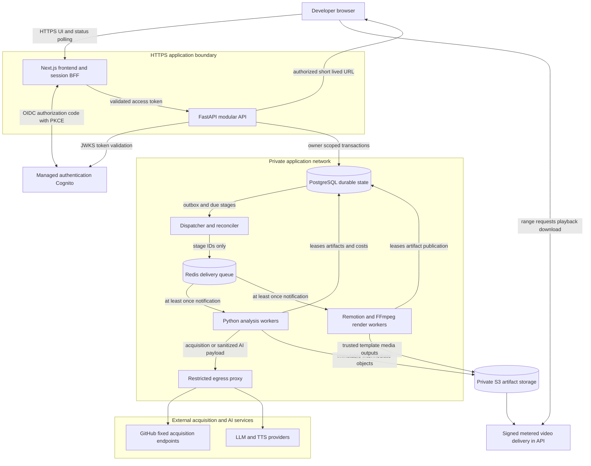

# SaaS architecture

Proposed, 2026-10-08. [PRD](../product/prd.md) · [Pipeline](pipeline.md) · [Persistence](data-model.md) · [Deployment](../operations/deployment.md) · [ADRs](../adr/README.md)

## Selected shape

One modular FastAPI backend owns authorization, projects, jobs, artifact access and usage. Next.js is the developer UI and same-origin session/BFF boundary. Python analysis and trusted TypeScript rendering use separately sized worker tasks. These are process roles of one product, not independent microservices. Dispatcher/reconciler shares backend code. PostgreSQL is authoritative; Redis/Celery only delivers notifications. No Kubernetes, service mesh, vector/graph database or event bus initially.

Proposed hosting: AWS ECS Fargate, RDS PostgreSQL, ElastiCache Redis OSS-compatible managed service, Cognito and private S3. Network/task-role isolation motivates the choice over Render; see [hosting comparison](../operations/deployment.md#hosting-comparison). No resources are provisioned.

## Architecture diagram

Browser cannot access DB/queue/workers. Acquisition/provider connections cross restricted egress; storage access has role and tenant boundaries.

## Technology decisions and alternatives

| Area | Selection | Trade-off / alternative |
| --- | --- | --- |
| Frontend | Next.js/TypeScript session BFF; 5-second polling | Typed UI/render ecosystem, extra server surface vs Vite SPA; server session avoids browser token persistence. No long render handlers. |
| API | FastAPI/Pydantic/OpenAPI modular backend | Python analysis alignment, two languages. Next.js-only reduces runtimes but complicates parsing integration. Never import repository modules. |
| Database | PostgreSQL + small JSONB manifests; S3 large immutable bodies | Transactional quota/leases/outbox/ownership, migrations required. SQLite weak distributed concurrency; document DB less natural relational owner constraints. |
| Queue | Celery/managed Redis, analysis/render routes | Mature Python tasks; trusted wrapper invokes Node rendering. Redis alone not durable workflow state. Temporal offers workflow features at greater initial operations complexity. |
| Parsing | Python + pinned Tree-sitter Python/JS/TS/TSX grammars | Syntax/import edges without execution; cannot prove dynamic calls. Regex too weak; language servers can invoke plugins/install. |
| LLM | Bounded structured provider adapter | Claude Haiku 4.5 cost candidate; exact production model requires quality/terms evaluation. Local models add compute; stronger models increase cost. No automatic escalation. |
| TTS | Provider adapter; Polly Neural cost candidate | Per-character budgeting/timing; pronunciation needs evaluation. Local TTS adds hardware/quality work, premium voices raise cost. |
| Video | Trusted Remotion templates + FFmpeg/probe | Typed scenes, motion/layout; Chromium memory/sandbox and license obligations. FFmpeg-only slides simpler/less expressive. Never accept generated JSX/JS. |
| Artifacts | S3-compatible contract, AWS S3 private origin; signed metered API delivery | Ranged proxy adds API bandwidth, but enforces byte quota/revocation; direct presigned S3 links permit repeated download until expiry. CloudFront/CDN deferred pending metering design; alternate S3 vendors add vendor/egress trade-offs. |
| Auth | Cognito OIDC; secure server session, API token validation | No passwords maintained. Auth0/Clerk turnkey UX at vendor cost; self-hosted auth raises burden. No GitHub repo OAuth permissions. |

Preferred technologies retained. Render uses bounded on-demand Fargate tasks instead of always-running render service; dispatcher controls starts and workers process eligible Redis notifications. CDN/WebSockets deferred. [ADR index](../adr/README.md) records reversal triggers.

## API boundary (design only)

- `POST /v1/projects`: canonical URL; `POST /v1/projects/{id}/jobs`: `Idempotency-Key`, consent/config, `202` job ID/SHA after validation/reservation. Generation asynchronous.
- `GET /v1/jobs/{id}` / `GET /v1/projects/{id}/jobs?cursor=...`: persisted status, ordered stages/timestamps/errors. Progress = completed stages of 14 plus active stage; explicitly not elapsed-time prediction.
- `POST /v1/jobs/{id}/cancel` / `retry`, `DELETE /v1/projects/{id}`: authorize owner, persist intent.
- `POST /v1/videos/{id}/playback-url` / `download-url`: owner/deletion/expiry checks; ≤5-minute signed delivery grant to API media route. API range proxy atomically reserves/counts response bytes against owner/job delivery quota before reading S3, forbids arbitrary object keys, rate-limits streams and checks grant/tombstone. Evidence endpoint returns only owner's redacted sidecar. No S3 URL exposed to browser.
- `422` validation, `429` quota, `409` idempotency body conflict, authorization-safe `404`, `503` dependency outage. Stable codes, no raw payload/error secrets.

Fixed GitHub HEAD resolution occurs at admission with short timeout. Failure returns `503`, no job/reservation. N-03 reports external validation separately. SHA recorded before archive acquisition; branch movement cannot change the job. [Stage contracts](pipeline.md#stage-contracts) specify the rest.
