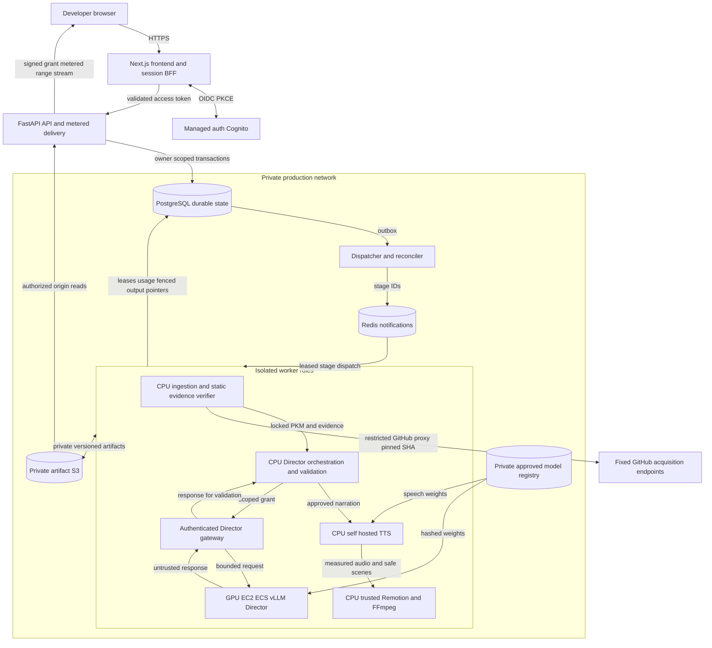
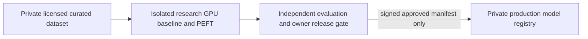

# SaaS architecture

Revised Phase 0 proposal, 2026-10-08; unapproved and unimplemented. [PRD](../product/prd.md) | [Pipeline](pipeline.md) | [Persistence](data-model.md) | [Deployment](../operations/deployment.md) | [Impact audit](../ai/change-impact.md) | [ADRs](../adr/README.md)

## Selected shape

One modular FastAPI backend owns authorization, projects, jobs, artifact access and usage. Next.js remains the developer UI/session BFF; PostgreSQL durable truth and Redis/Celery notifications, CPU analysis, trusted Remotion/FFmpeg and signed metered API media delivery remain. No Kubernetes or unnecessary microservices.

**Self-hosted inference is the primary production strategy.** RepoVox Director is a private GPU serving boundary consuming verified PKM/evidence and returning schema-constrained data; separate CPU self-hosted TTS creates audio. Normal generation requires no paid third-party LLM/TTS API. External AI experiments need explicit owner approval, permitted data/terms and a separate budget, never silent fallback.

CPU frontend/API/ingestion/render/TTS on ECS Fargate; Director on GPU-capable EC2 registered with ECS, **not GPU Fargate**. Training/evaluation account/workloads independent of inference/customer data; only approved hashed releases cross the registry boundary. A provisional unchanged base is not custom-trained. [Director](../ai/director-architecture.md), [selection](../ai/model-selection.md), [training](../ai/training-strategy.md), [evaluation](../ai/evaluation-plan.md) and [speech](../ai/speech-strategy.md) define promotion gates.

## Architecture diagram

Training receives only licensed curated data, never production prompts. The gateway is private/authenticated; inference/TTS runtime has no internet egress. Video delivery is a role inside API, not a new independent service.

Worker-to-worker arrows show persisted artifact dependencies, not synchronous combined execution: each stage uses its own lease/role and private object/checksum pointer. Gateway reads authorization/fences and persists model operation state through restricted PostgreSQL procedures; engine has no direct database/customer-bucket access. Inference and TTS have no internet egress. CPU services run on Fargate; GPU service uses EC2, not Fargate.

Research/training has separate account/IAM/storage; no production customer prompts or customer-prefix access. The release gate alone publishes reviewed model assets. This is a proposal, not deployed infrastructure.

## Technology decisions and alternatives

| Area | Selection | Trade-off / alternative |
| --- | --- | --- |
| Frontend/API | Next.js/TypeScript session BFF + FastAPI/Pydantic modular API | Two languages but Python analysis alignment and typed render UI; SPA/Next-only simpler runtime but extra session/parser integration. |
| Durable data/queue | PostgreSQL RLS/FKs/outbox/leases + Redis/Celery delivery | Preserve idempotency/history under redelivery/loss; Temporal adds operations burden. No workflow truth in Redis. |
| Analysis | Bounded Python Tree-sitter grammars and safe manifest readers | Static facts and qualified inference; regex too weak, project language servers risk execution. Never install or execute repository code. |
| Director | Provisional Qwen2.5-Coder-14B unchanged baseline, private vLLM, reviewed quantization; RepoVox adapter only after evaluation | Open-weight licensing/VRAM/idle costs; SGLang/llama.cpp and ranked models evaluated under same gates. Paid AI comparator is not production dependency. |
| TTS | CPU self-hosted Kokoro-82M candidate; Piper alternative | Voice/license/safe-format/CPU timing audit required. No paid API required. |
| Render | Trusted Remotion templates + FFmpeg/probe, data only | Chromium memory/sandbox/license gates; generated executable JSX/commands forbidden; FFmpeg-only slides alternative less expressive. |
| Objects/delivery | S3-compatible storage, private AWS S3; signed metered FastAPI stream | Adds API bandwidth to enforce replay byte quotas; direct S3 links lack hard transfer quota. CDN deferred. |
| Auth | Cognito OIDC, server session and API validation | Avoids app-managed passwords and aligns AWS identity controls, with OIDC/UI integration work; Auth0/Clerk simplify SDK/UI but change pricing/vendor dependency, self-host identity adds security/on-call burden. |
| Hosting | Fargate CPU + ECS GPU EC2; isolated training | GPU fleet/driver/idle overhead; GPU container provider and lower-cost private GPU VM compared in deployment. Fargate does not supply GPU acceleration. |

[ADR index](../adr/README.md) records reversal triggers. Managed infrastructure/vendor costs are allowed; third-party paid AI inference is exceptional owner-approved evaluation only. Nothing provisioned.

## API boundary (design only)

- `POST /v1/projects`: canonical URL; `POST /v1/projects/{id}/jobs`: `Idempotency-Key`, consent/config, `202` job ID/SHA after validation/reservation. Generation asynchronous.
- `GET /v1/jobs/{id}` / `GET /v1/projects/{id}/jobs?cursor=...`: persisted status, ordered stages/timestamps/errors. Progress = completed stages of 14 plus active stage; explicitly not elapsed-time prediction.
- `POST /v1/jobs/{id}/cancel` / `retry`, `DELETE /v1/projects/{id}`: authorize owner, persist intent.
- `POST /v1/videos/{id}/playback-url` / `download-url`: owner/deletion/expiry checks; ≤5-minute signed delivery grant to API media route. API range proxy atomically reserves/counts response bytes against owner/job delivery quota before reading S3, forbids arbitrary object keys, rate-limits streams and checks grant/tombstone. Evidence endpoint returns only owner's redacted sidecar. No S3 URL exposed to browser.
- `422` validation, `429` quota, `409` idempotency body conflict, authorization-safe `404`, `503` dependency outage. Stable codes, no raw payload/error secrets.

Fixed GitHub HEAD resolution occurs at admission with short timeout. Failure returns `503`, no job/reservation. N-03 reports external validation separately. SHA recorded before archive acquisition; branch movement cannot change the job. [Stage contracts](pipeline.md#stage-contracts) specify the rest.
